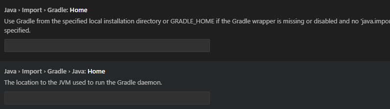
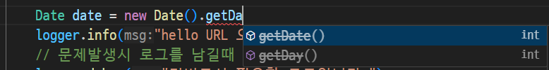

# Java_SpringBoot_2025
Java 개발자 과정 SpringBoot

## 1일차

### 웹 개요
- 구성 3단계
    - 브라우저(클라이언트/프론트앤드) : 사용자의 **요청**, 결과를 돌려받는 파트트
    - 서버(벡앤드) : 사용자의 요청을 받아 DB에서 데이터를 가져와 처리하고, 사용자에게 **응답**하는 파트
    - 데이터베이스 : 가장 중요한 데이터가 저장되어 있는 파트

- 웹 개념
    - 사용자 Request(요청)에 대한 Response(응답답)

### SpringBoot 개요
- Java : 컴퓨팅 세상 모든곳에서 사용될 수 있는 언어가 되고자 개발됨
- 웹개발
    1. CGI(Common GataWay Interface) : HTTP 프로토콜에서 정적인 데이터만 전달할 수 있는 웹기술
    2. Servlet : CGI를 개선한 Java 웹기술. 동적으로 개발할 수 있음
        - HTML코드를 전부 JAVA에서 작성성
    3. EJB(Enterprise Java Bean) : 서블릿으로 대형 프로젝트를 개발할 수 있는 Java 웹기술
        - 복잡잡
    4. JSP(Java Server Page) : 웹페이지 코드(HTML)에 자바소스를 포함하여 개발할 수 잇는 JAVA 웹기술
        - 확장자 .jsp / 스파게티 코트
    5. Spring : JAVA 웹개발 전성기
        - 설정이 복잡
    6. Spring Boot : Spring의 단점을 최소화. 설정을 간결과

- Spring Boot
    - Spring의 기술을 그대로 사용(마이그레이션이 간단)
    - JAVA 기술을 사용하면 ERD나 DB설계를 하지 않고도 손쉽게 DB를 생성, DB 연동도 쉬움
    - Tomcat Webserver가 내장(설치 필요없음)
    - 서포터하는 기능 다수 존재(개발을 쉽게 도와줌)
    -  테스트용 JUnit, Log432 모두 포함(설치 필요없음)
    - 프론트엔드를 다양하게 지원, JSP,**Thymeleaf**, Mustache 등
    - React, View, js 등의 자바스크립트 프론트엔드와 연계해서 풀스택 개발 가능
    - MVC(Model View Controller)로 영역을 분리. 각 부분별로 따로 개발발

- MVC
    

### Spring Boot 개발환경 설정
- 필요요소
    - Java, 개발툴, 데이터베이스

- Java
    - Java Runtime과 JDK(Java Developer Kit) 존재
        - Oracle 외에도 OpenJdk가 산재
        - https://adoptium.net/
        - https://www.azul.com/downloads/?package=jdk#zulu
        - https://jdk.java.net/
    - Java 17버전 이상 설치
    - https://www.oracle.com/kr/java/technologies/downloads/
    - jdk-17.0.13_windows-x64_bin.msi 다운로드

    - 시스템 정보(sysdm.cpl) 고급>환경변수 PATH 설정
        - 새로 만들기
            - JAVA_HOME : 본인 경로 입력
        - path에 %JAVA_HOME%\bin 추가, 맨 위로
    - powershell
        - java -version으로 확인

- Visual Studio Code
    - Java 검색
        - Extension Pach for Java 설치.
        - Debuhher for Java 등 총 7가지 확장 설치

### Java 기본 실행
- VS Code에서 명령팔레트 실행(Ctrl + Shift + p)
    1. Java create Java Project > maven
    2. no Archtype
    3. Group ID 입력(com.example > 원하는 이름)
    4. Artifact ID 입력(demo > 변경가능)
    5. 저장위치 결정

### Spring Boot 설정
- Visual Studio Code 확장 설치
    - Spring 검색
        - Spring Boot Extension Pack 설치 -> 모두 설치됨(추가 3개)
    - Gradle(빌트툴) 검색
        - Gradle for Java 설치

### Spring Boot 기본 실행(Java)프로젝트
- VS Code에서 명령 팔레트 실행
    - Spring Initializr : Create a Maven Project
    - Specify Spring Boot version : 3.3.10 선택
    - Specify project langauge : Java
    - Input Group Id: 본인 아이디 입력 / com.yej
    - Input Artifact Id: spring01
    - Specify packaging type: Jar(Java archive, 압축파일)
    - Specify Java version : 17
    - Choose dependencies: Selected 0 dependcies
    - 저장위치 선택
    - **새 창 열기** - Spring Boot 프로젝트가 루트폴더가 된 개발 환경

- 실행방법
    - 코드 작성
    - Spring Boot Dashboard > Apps > 앱 실행

- 기초 문법
    - [JAVA기초문법](./JAVA_BASIC.md)
    - 기본, 변수, 자료형, 연산자, 흐름제어
## 2일차
- 기초문법 계속
    - [JAVA기초문법](./JAVA_BASIC.md)
    - 흐름제어(반복문), 배열, 메서드, 객체/클래스, 상속

## 3일차
- 기초문법 계속
    - [JAVA기초문법](./JAVA_BASIC.md)
    - 상속, 인터페이스, 예외처리, 제네릭, 컬렉션 프레임워크, 입출력

### Spring Boot Build Tool
- 개요
    - 프로젝트 빌드 과정을 자동화시켜주는 도구
    - 컴파일, 테스트, 패키징, 의존성 관리, 배포 등을 포함

- Maven
    1. Java 프로젝트 기본 빌드도구
    2. Maven Repository, https://mvnrepository.com/ 검색 가능능
    3. 빌드, 패키징(jar/war 파일 생성), 테스트 등을 한번의 명령으로 간편하게 처리
    4. 가장 큰 특징이 외부 라이브러리 자동으로 다운로드, 관리s
    5. pom.xml(Project Object Model) 파일로 빌드 설정 관리
        - 초기설정시 빠졌거나, 추가되어야 하면  xml 코딩으로 추가
    6. VSCode 확장 중 Maven Dependency Explorer 등으로 확인

- Gradle
    1. 안드로이드용 오픈소스 빌드도구
    2. Maven Repository를 같이 사용
    3. Maven의 3,4번 특징을 그대로 가지고 있음
    4. build.gradle 파일 사용. Groovy 스크립트 지원
    5. 빌드 과정을 병렬 처리, 캐싱사용으로 Maven보다 10~100배 향상된 성능 구현


### Gradle 설정
- Gradle로 프로젝트가 제대로 동작하지 않으면
    - https://gradle.org/ 에서 gradle 단운로드
    - 설리 경로 확인, 설치
    - 시스템 등록정보 PATH 지정 . gradle_home 사용
 
### Spring Boot 로그 설정
- Spring Boot를 colorizing 해주는 기능
- src/resources/application.properties

    ```shell
    spring.output.ansi.enabled=always
- 서버 재시작

## 4일차
- 기초문법 마무리
    - [Java 기초 문법](./JAVA_BASIC.md)
    - 제네릭, 컬렉션 프레임워크, 입출력, 람다식, 스트림API

- Spring Boot 시작
- Gradle 오류 해결법
    - [gradle](https://gradle.org/install/)
    - C:\Gradle 위치에 압축 해제
    - sysdm.cpl 환경변수 GRADLE_HOME 경로 입력, 확인(JAVA_HOME 동일)
    - VS Code 설정

    
    - Gradle Build Server : Enabled 기본 on -> off

    
    - Gradle Home -> 환경변수 입력한 GRADLE_HOME의 경로 입력
    - GRADLE JAVA HOME -> 환경변수 JAVA_HOME의 경로 입력

    - VS Code 재시작.

## 5일차
- Spring Boot 웹실행
    - Spring Initializr: Create a Gradel Project
    - Specify Spring Boot version: 3.4.4
    - Specify project language: Java
    - Input Group Id: 본인 아이디 입력/com.jsz
    - Input Artifact Id: Spring01
    - Specify packaging type: Jar(Java archive, 압축파일)
    - Specify Java version: 17
    - Choose dependencies: Selected 1 dependencies 
        - Spring Web
    - 저장 위치 선택
    - 새 창 열기 - Spring Boot 프로젝트가 루트 폴더가 된 개발 환경

- 기본 성정
    - application.properties에 `spring.output.ansi.enabled=always` 추가

- 포트 번호
    |프로토콜|포트번호|비고|
    |:---|---:|:---|
    |HTTP|80|웹 서비스 포트(보안 취약)|
    |HTTPS|443|SSL을 적용한 웹 서비스(보안 강화)|
    |FTP|21|웹을 통한 파일전송|
    |TELNET|23|원격서버접속 서비스|
    |SSH|22|보안 강화된 텔넷|
    |SMTP|25|메일 전송 서비스|

- 개발용 포트
    - 포트는 중복 안 됨
    - 8080 포트를 사용하고 있으면 다른 포트로 변경해야 함
    - 포트 변경시 application.properties에 `server.port=8090` 추가

- 웹 브라우저 열기
    - http://localhost:8090/ 오픈

    

- 접속 위치 요청 처리
    - 컨트롤러 생성
        - HelloController 클래스 생성
        - http://localhost:8090/hello

    - 각 기능별로 패키지를 구분
        - controller, model 등...

- Log-back
    - 스프링부트에 내장된 로그 모듈
    - application.properties 내 로그 설정

    ```groovy
    logging.level.root = info
    logging.file.name = /logtest.log
    ```

    - 사용 시
    ```java
    // 클래스 내 작성
     private final Logger logger = LoggerFactory.getLogger(this.getClass());

    // 메서드 내 사용
    logger.info("hello URL 오픈"); 
    
    // 문제 발생 시 로그
    logger.debug("디버그 시 필요한 로그입니다.");
    logger.trace("디버그 시 필요한 로그입니다.");

    logger.warn("경고 표시시 나타내는 로그입니다.");
    logger.error("오류 표시시 나타내는 로그입니다.");
    ```

- Log4J2 외부모듈 사용 권장.

### 스프링부트 배너(중요도 없음)
- resources 폴더에 banner.txt를 생성
- 내용 추가
- [Spring Boot Banner Generator](https://devops.datenkollektiv.de/banner.txt/index.html)
- 배너제너레이터로 생성한 글자 복사 banner.txt 붙여넣기
- 서버 재시작


### 메인페이지 추가
- resources/static/index.html 부터 시작

### 스프링부트 프로젝트 구조


- 각 폴더 구조
- .gradle ~ gredle : 그레이들, VSCode, 빌드 등에 필요한 폴더(설명필요x)
- `src/main/java` : 패키지와 자바 소스가 저장되는 위치
- com.yej.spring03 : 패키지. 폴더로 구성
    - HelloController 클래스에 접근하려면
    - com.yej.spring03/controller.HelloController 에 접근해야함
- Spring03Application.java : 시작프로그램
- src/main/resources : 자바파일 외에 HTML, CSS, JS, 환경파일 등 리소스 파일 저장되는 위치
    - `static` : CSS, JS, 이미지 파일 저장되는 곳
    - `templates` : 스프링부트와 연계되는 HTML 파일 저장되는 곳
    - `application.properties` : 프로젝트 환경설정 파일. 환경변수, DB 설정
- src/test/java : JUnit 스프링부트 테스트도구 자바파일 저장되는 위치
- `build.gradle` : 그레이들 환경 파일. Groovy 기반으로 한 빌드 도구. dependencies 만 잘 구성하면 됨
- gradlew.bat : 중간에 직접 그레이들 빌드를 할 때 사용하는 배치파일
- settings.gradle : 고급 그레이들 설정. 손댈일 없음

### 스프링부트 어노테이션

#### @SpringBootApplication
- 스프링부트 자동구성 매커니즘 활성화
- 어플리케이션 내 패키지에서 컴포넌트들 스캐닝
- 설정 클래스 임포트해서 활성화, 스프링부트 실행

#### @Controller
- 컴포넌트 구체화해서 해당클래스 IoC컨테이너 Bean으로 등록

#### @GetMapping
- Get, Post 중 Get(URL)으로 들어오는 주소를 매핑. 처리해주는 역할
- @PostMapping, @RequestMapping 등 파악

#### @ResponseBody
- HTTP 요청의 자바객체가 처리한 body내용을 매핑하는 역할
- 자바의 String 문자열을 웹페이지에 렌더링.


#### 어노테이션
- 한글로 주석이지만, #, //, /**/ 소스에 아무런 영향을 미치지 않는 주석과 다름
- 자바 소스에 추가해서 여러가지 기능을 수행하는 메타데이터 일종
- @로 시작, JDK 1.5 이상부터 사용가능
- 클래스 파일에 같이 포함되어서 JVM 작동시 처리 실행됨
- 클래스, 메서드 바로 위에 작성. 코드와 설정을 관리할 수 있게 도와주는 역할

##### 1. @Override
- 오버라이드를 올바르게 했는지 컴파일러 체크
- 상속, 인터페이스 구현시 사용

##### 2. @Deprecated
- 앞으로 다음 버전에서 삭제될 수 있음. 사용하지 말것을 권유하는 체크


- 되도록이면 이 함수는 사용하지 말것

##### 3. @FunctionalInterface
- 함수형 인터페이스에 붙여서, 컴파일러가 올바르게 작성되었는지 체크


## 6일차(06-26)


## 6일차
